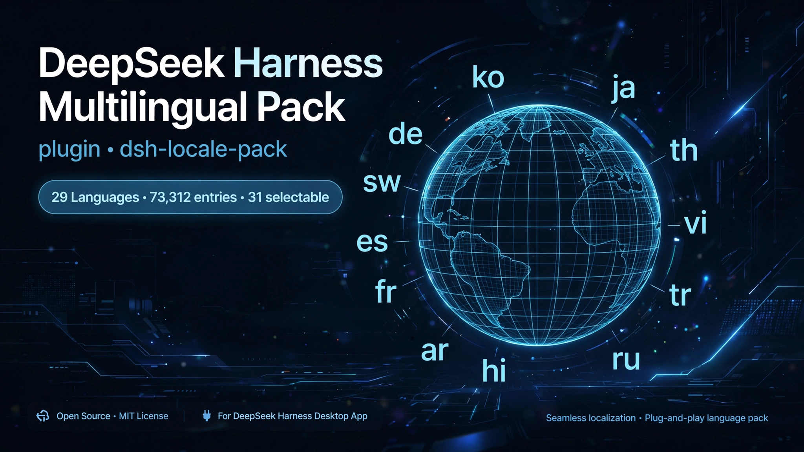
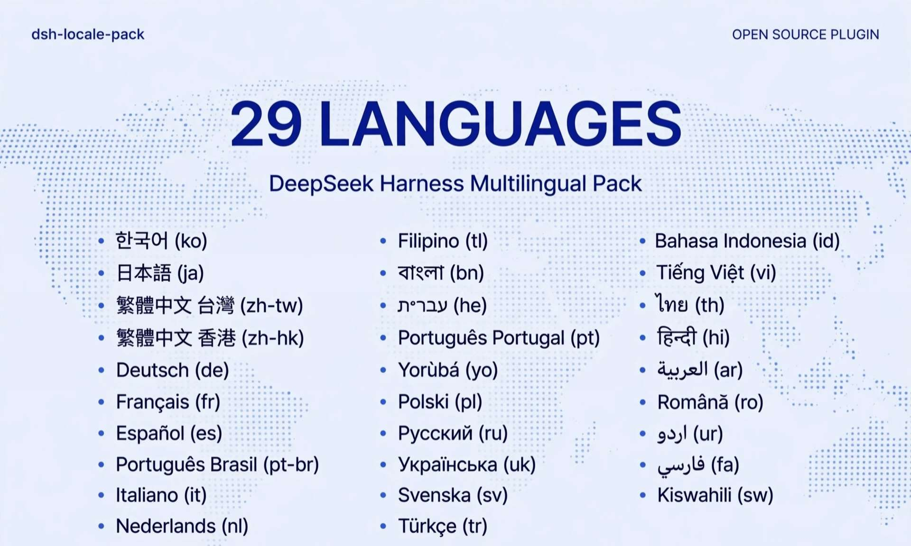

# dsh-locale-pack

<p align="right"><strong>English</strong> | <a href="README.ko.md">한국어</a></p>

<p align="center"></p>
<p align="center"></p>

A locale pack for the DeepSeek Harness desktop app. It registers 29 languages in the language picker and ships a dictionary for each one. Strings that are not translated yet fall back to English, so the screen stays readable while coverage grows. DeepSeek Harness ships English and Simplified Chinese by default, which makes 31 languages selectable after install.

## Why this exists

DeepSeek Harness is a coding tool: you hand it a task and the agent reads files, edits them, and runs terminal commands. Its desktop interface is built around chat, settings, plugin management, sub-agents, task history, approval prompts, voice input, and scheduled jobs.

That interface was available in English and Simplified Chinese. Developers who prefer to work in another language had to read every label in a second language. This project fills that gap by adding the dictionaries, and by keeping the number of languages wide rather than deep: a language is usable once the picker offers it and the common screens are readable.

## Supported languages

| Language | Code | Language | Code |
|---|---|---|---|
| 한국어 | `ko` | Polski | `pl` |
| 日本語 | `ja` | Русский | `ru` |
| 繁體中文 (台灣) | `zh-tw` | Українська | `uk` |
| 繁體中文 (香港) | `zh-hk` | Svenska | `sv` |
| Deutsch | `de` | Türkçe | `tr` |
| Français | `fr` | Bahasa Indonesia | `id` |
| Español | `es` | Tiếng Việt | `vi` |
| Português (Brasil) | `pt-br` | ไทย | `th` |
| Italiano | `it` | हिन्दी | `hi` |
| Nederlands | `nl` | العربية | `ar` |
| Filipino | `tl` | Română | `ro` |
| বাংলা | `bn` | اردو | `ur` |
| עברית | `he` | فارسی | `fa` |
| Português (Portugal) | `pt` | Kiswahili | `sw` |
| Yorùbá | `yo` | | |

29 languages × 2,528 keys = 73,312 translated entries. The dictionaries are built against DeepSeek Harness `0.2.0-rc.2`.

## Install

The DeepSeek Harness desktop app has to be installed first. Then clone the repository and register it as a plugin link.

macOS and Linux (bash):

```bash
# 1) Get the sources
git clone https://github.com/sayho-pm/dsh-locale-pack.git
cd dsh-locale-pack

# 2) Register the folder with the desktop profile
dsh plugin --profile desktop add link:$(pwd)
```

Windows (PowerShell):

```powershell
# 1) Get the sources
git clone https://github.com/sayho-pm/dsh-locale-pack.git
cd dsh-locale-pack

# 2) Register the folder with the desktop profile
dsh plugin --profile desktop add link:(Get-Location).Path
```

Then open **Settings → Language** and pick the language you want.

### Install with an AI assistant

If you do not have a development environment, an AI assistant can do the setup for you. Open the assistant and paste this:

```
Install this GitHub repository: https://github.com/sayho-pm/dsh-locale-pack
Wherever I have to type something myself, such as a token or a path,
mark it with **** and tell me exactly where it goes. Handle the rest.
```

The assistant runs the commands and stops only at the points that need your input.

## Repository layout

```text
locale/<language>/*.json   Dictionary sources — edit here
locale/_policy/            Terms kept in English
lib/client.js              Generated bundle (from the dictionaries)
tools/build-client.mjs     Dictionaries → lib/client.js
tools/smoke.mjs            Smoke test
tools/check-keep.mjs       Translation quality check
tools/translate_worker.py  Translation worker (runs outside the chat session)
tools/clean-romanized.py   Fixes transliteration slips
tools/en.baseline.json     English baseline (DeepSeek Harness 0.2.0-rc.2)
```

## Editing a string

```bash
node tools/build-client.mjs   # rebuild lib/client.js
node tools/smoke.mjs          # self-check: loading, fallback, idempotence
node tools/check-keep.mjs     # translation quality check
```

Placeholders such as `{name}` must be kept exactly as they are. If the order or the spelling changes, the sentence breaks at runtime.

### Bundling only the languages you need

Installing the whole pack is the default, and switching language afterwards is a matter of the settings screen. When the full bundle is more than you want, build a subset instead:

```bash
node tools/build-client.mjs --langs ko,ja   # Korean and Japanese only
```

A two-language bundle comes out at roughly 320 KB instead of 4.2 MB. The flag accepts any comma-separated list of the language codes in the table above. Omitting it rebuilds every language.

## Translation quality checks

`tools/check-keep.mjs` compares every language against the English baseline and reports five things:

1. Placeholders such as `{name}` appear the same number of times as in the source
2. Product and protocol names (DeepSeek Harness, MCP, JSON, OpenAI Responses, and others) are left untranslated
3. Languages that do not use Chinese characters contain none
4. Korean sentences contain no em dashes
5. No value is empty, and no key is present that the baseline does not define

Terms that stay in English are collected in `locale/_policy/keep-english.json`. Add a term there to keep it untranslated.

## Re-running the translation

Translation runs in a separate process from the chat session. Nothing from the session model or the conversation history is attached to a request: only the English source strings leave the machine.

```bash
python3 tools/translate_worker.py --langs ja,de      # specific languages
python3 tools/translate_worker.py --all              # everything
```

Requests move through four models in order. If the first one fails, the worker retries along an equivalent route, then an earlier version, and finally a model that is not used for training. `번역_로그` records which model handled each batch.

## Notes for users

- Arabic, Urdu, Hebrew, and Persian are written right to left. The dictionaries are ready; the screen layout is handled by DeepSeek Harness itself.
- The menu bar, the right-click menu, and the update dialog belong to the desktop shell, so this pack does not change them.
- When DeepSeek Harness ships a new version, new strings appear in English until they are translated.
- Korean is reviewed by hand. Other languages come from machine translation, and each language's dictionary file is the place to adjust wording.

## Contributing

Requests for additional languages are welcome. Open an issue in this repository naming the language, and it gets picked up in the next round. Corrections to an existing language go straight into that language's dictionary file under `locale/<language>/`, and a pull request is the easiest form.

## License

MIT
